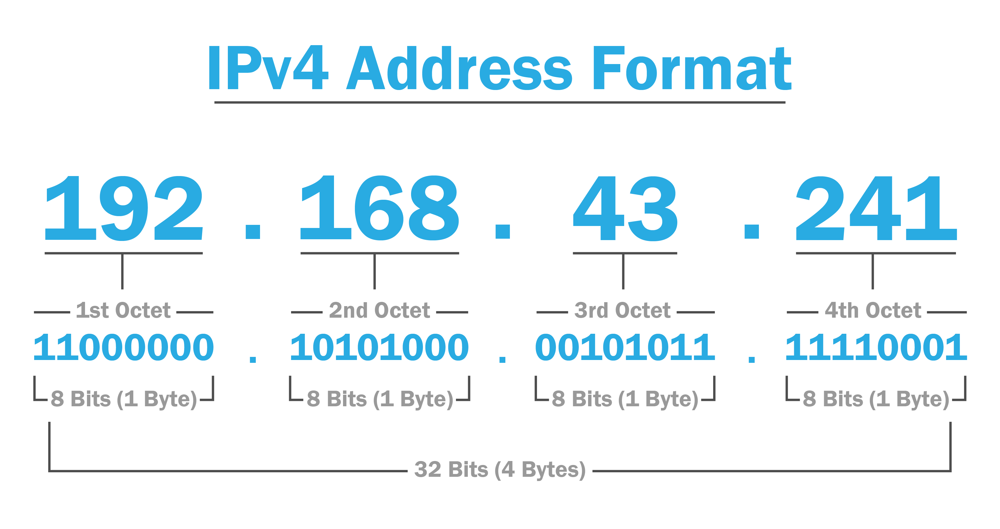

# AWS VPC (Virtual private cloud)
- Build you own newtwok in account in the region
- Logical data center in region
- can select ranges , subnets , routing tables and gateways

### Ipv4
- total addr of 32bit divided into 4 octate each of 8 bit
   
-Ipv4 range i.e b/w 0.0.0.0 and 255.255.255.255
- divided inti 2 part
    - public ip (internet)
    - private ip (local network design)
- private ip ranges:
    - class A => 10.0.0.0 - 10.255.255.255
    - class B => 172.16.0.0 - 172.31.255.255
    - class C => 192.168.0.0 - 192.168.255.255
    - class D and E for reseach and multi-casting
- Dividing the ranges into subnets masks (A subnet mask is a 32-bit number used to divide an IP address into its network and host portions and It helps determine which part of an IP address identifies the network and which part identifies a specific device on that network.)
    - 255.0.0.0
    - 255.255.0.0
    - 255.255.255.0
Example:
- My Ipv4 addr is `192.168.1.2`
- subnet mask is `255.255.255.0`
- by seeing subnet mask only octate 4 is 0 untill all are 255 that says in in ipv4 address the 1st 3 oactate refers to network ip and the 4th octate is assignable (i.e host addr)
hence the ranges are from  
192.168.1.0 -> Network ip 
192.168.1.1 -> first usable Ip 
192.168.1.2  
. 
. 
. 
. 
192.168.1.252  
192.168.1.253  
192.168.1.254 -> last usable ip 
192.168.1.255 -> broadcast ip  

Total IP = 256
Total Usable IP = 256 - (network ip + broadcast) => 254

#### CIDR -> Classless internet domain routing
- Subnet mask : 255.0.0.0
- In binary : 11111111.00000000.00000000.00000000
- CIDR: /8 (i.e total 1's in binary ip)

- Subnet mask : 255.255.0.0
- In binary : 11111111.11111111.00000000.00000000
- CIDR: /16 (i.e total 1's in binary ip)

- Subnet mask : 255.255.255.0
- In binary : 11111111.11111111.11111111.00000000
- CIDR: /24 (i.e total 1's in binary ip)

For example:
- if ip is **172.20.0.0/16** it says 1st 2 octate for network and last 2 octate for host
- If divide furthor for network range 172.20.0.0/16 the subnets are
- 172.20.0.0/24
- 172.20.1.0/24
- 172.20.2.0/24
- 172.20.3.0/24
- 172.20.4.0/24
- follws to 172.20.255.0/24 i.e total 256 /24 subnets

- Ip subnet calcullator [IP calculator](https://jodies.de/ipcalc)
