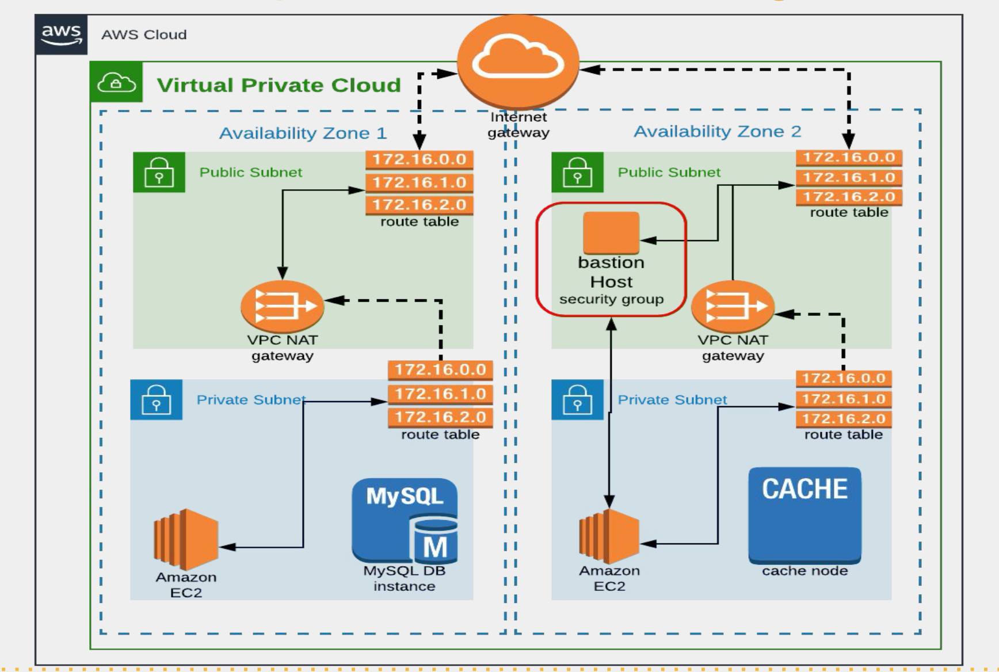

# AWS VPC (Virtual private cloud)
- Build you own newtwok in account in the region
- Logical data center in region
- can select ranges , subnets , routing tables and gateways

### Ipv4
- total addr of 32bit divided into 4 octate each of 8 bit
   
-Ipv4 range i.e b/w 0.0.0.0 and 255.255.255.255
- divided inti 2 part
    - public ip (internet)
    - private ip (local network design)
- private ip ranges:
    - class A => 10.0.0.0 - 10.255.255.255
    - class B => 172.16.0.0 - 172.31.255.255
    - class C => 192.168.0.0 - 192.168.255.255
    - class D and E for reseach and multi-casting
- Dividing the ranges into subnets masks (A subnet mask is a 32-bit number used to divide an IP address into its network and host portions and It helps determine which part of an IP address identifies the network and which part identifies a specific device on that network.)
    - 255.0.0.0
    - 255.255.0.0
    - 255.255.255.0
Example:
- My Ipv4 addr is `192.168.1.2`
- subnet mask is `255.255.255.0`
- by seeing subnet mask only octate 4 is 0 untill all are 255 that says in in ipv4 address the 1st 3 oactate refers to network ip and the 4th octate is assignable (i.e host addr)
hence the ranges are from  
192.168.1.0 -> Network ip 
192.168.1.1 -> first usable Ip 
192.168.1.2  
. 
. 
. 
. 
192.168.1.252  
192.168.1.253  
192.168.1.254 -> last usable ip 
192.168.1.255 -> broadcast ip  

Total IP = 256
Total Usable IP = 256 - (network ip + broadcast) => 254

#### CIDR -> Classless internet domain routing
- Subnet mask : 255.0.0.0
- In binary : 11111111.00000000.00000000.00000000
- CIDR: /8 (i.e total 1's in binary ip)

- Subnet mask : 255.255.0.0
- In binary : 11111111.11111111.00000000.00000000
- CIDR: /16 (i.e total 1's in binary ip)

- Subnet mask : 255.255.255.0
- In binary : 11111111.11111111.11111111.00000000
- CIDR: /24 (i.e total 1's in binary ip)

For example:
- if ip is **172.20.0.0/16** it says 1st 2 octate for network and last 2 octate for host
- If divide furthor for network range 172.20.0.0/16 the subnets are
- 172.20.0.0/24
- 172.20.1.0/24
- 172.20.2.0/24
- 172.20.3.0/24
- 172.20.4.0/24
- follws to 172.20.255.0/24 i.e total 256 /24 subnets
- Formula to calculate the available IP address using CIDR is
<pre>
    Total available IP's = 2(32-CIDR)
</pre>
- Ip subnet calculator [IP calculator](https://jodies.de/ipcalc)

### Types of subnet

- Public Subnet (ex: wifi router) : Connected to internet gateway which allows to and fro internet connection
- Private Subnet (ex: device connected to router) : where the traffic cannot get directly in to private subnet , it doesnot have any public Ip's, if it need to connect to internet then it is going to connect to NAT gateway then it can use the internet to download any packages

### Some Imp Notes
- NAT : Network Address Translation gateway to enable instances in private subnet to connect to internet or other AWS services.

- NAT gatway need to be stay in the public subnet and it connects internet through internat gateway. That NAT gatwway using by private subnet to access internet

- An internet gateway is a horizaontally scaled, redundent, and highly available VPC component that allows communication b/w instances in your VPC and the internet

- Route Table : Which is attached to subnet and it will tell it has to transfer ther traffic to internet gateway and the route table will tell whether the traffic has to go to the nat gateway

- We can connect to private subnet from bastion server (Jump server)
- **Subnets by defaults it doesnot allocate the public IP Need to Enable int manualy**

### Default VPC
⚠️ Danger: Do not delate the Default VPC
- Every region have default VPC
- If you delete it you need to contact aws to create 1
- It has 2 public subnets
    - The total available ip's in each subnets are 4091 (5 ip's from each public subnet used by AWS for internal purpose)
- You can determine whether it is public ot private subnet by seeing its route table. **The public IP's are connect to internet gateway with destinatioon IP 0.0.0.0/0** and if **subnet connect to NAT gateway It is private subnet**

### Bastian host (jump server):
- basically a security group in AWS
- Assign to some host to access/changes the data from private instances
- It will be in one public subnet. So first need to access to public instance then we can access the private subnet
- need to be more secured

### VPC Peering
- Connecting VPC and VPC (2 VPC's)
- CIDR Range cannot be overlapped b/w VPC's
- we can do this using peering connection in AWS
- you need to create a request from 1 and accept a request from another VPC
- So when the instance is created it won't get where to send the traffic (VPC) so in routing table we need to add a rule by adding CIDR range of another VPC and Target is peering connection
- You cannot select the VPC of another region in security group so add a roles in security groups od instances allowing the VPC's private IP's

## Project

### Set Up details (network design)

- VPC Range : 172.20.0.0/16
- 4 Subnet :
    - 2 Public
    - 2 Private
- Region : us-west-1 (because it has only 2 zone it helps for learning)
- Zones:
    - us-west-1a
    - us-west-1b
- Subnet distribution :
    - 172.20.1.0/24 -> pub-sub1 : [us-west-1a]
    - 172.20.2.0/24 -> pub-sub2 : [us-west-1b]
    - 172.20.3.0/24 -> priv-sub1 : [us-west-1a]
    - 172.20.4.0/24 -> priv-sub2 : [us-west-1b]
- Components needed:
    - 1 Internet gateway
    - 2 NAT Gateway (for high availabity, we can also use only one) (NAT Gatway is costable in AWS) (for this you can create only 1 to save cost)
    - 2 Elastic IP (For each NAT Gateway)
    - 2 Route Table :
        - 1 for public subnet
        - 1 for private subnet
    - 1 Bastion host (in public subnet)
- NACL (for subnet) : Network access control list it is similar to security groups but security groups is for instances but NACL for subnets , we can do both allow and deney in NACL (only allow in sg's)
- 1 Extra VPC - for VPC peering
- Load balancer in public subnet, it need to able to route traffic to private subnet

#### Points to remember
- Subnets by defaults it doesnot allocate the public IP Need to Enable int manualy
- NAT gatway need to be stay in the public subnet and it connects internet through internat gateway. That NAT gatwway using by private subnet to access internet
- Allow Enable DNS hostname to get allot hostnames along with IP address
- Make sure to select the specific VPC in everywhere(imp in bastion host sg) of not you not able to complete it.
- in real time F\for bastion host please use the AMI that are tested for vulnarability
    - ex: cis AMI's (center of internet security)
    - you can use any AMI for learning purpose
- Place the bastion host in public subnet
- To access the instance of private subnet we need the key pair in bastion host you can use the below cmd to copy from working host
    - `scp -i Downloads/vpro-bastion-key.pem Downloads/web-key.pem ubuntu@54.177.115.171:/home/ubuntu`
- You cannot access the instance in private subnet using MYIP in sg it need to be bastion host sg
- Load balances subnets need to be public subnets
