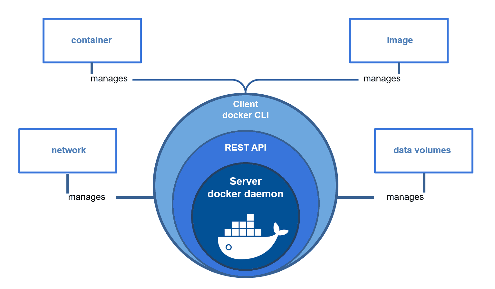
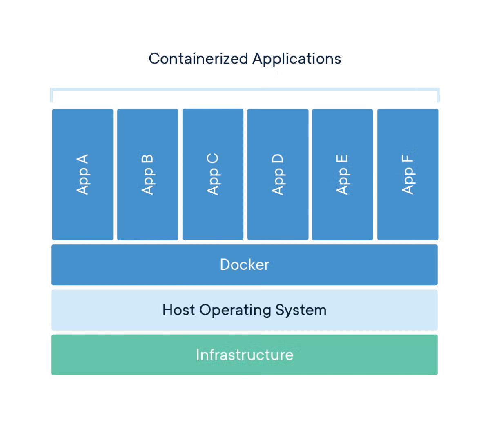

# Dockers and Containers

### Problems
- High CapEx and OpEx
- Human Errors in deployment
- Not Compatible with microservices architecture
- Resource Wastege
- Not Portable, Env not in syncs (dev, prod,stage,prod)

### Solution
- Containers
- Consumes low resources - because there is no OS in that.
- Suits very well for microservices
- Deployments vis images 
- Same container images across environment
- Reuseable & Repeatable

### Containers
- Containers are an abstraction at the app layer that packages code and dependencies together. Multiple containers can run on the same machine and share the OS kernel with other containers, each running as isolated processes in user space. Containers take up less space than VMs (container images are typically tens of MBs in size), can handle more applications and require fewer VMs and Operating systems.

#### V/S Virtual Machines
- Containers offers Isolation not virtualization
- Containers are OS virtualization
- VM's are Hardware virtualization
- VM needs OS
- Containers don't need OS
- Containers uses Host OS for Compute resources

## Docker
- Manages the containers (containers run time environment)
- containers may no need of docer

### history
- Formaly known as DOTCloud Inc
- Into PAAS buiness
- Use LXC (Linux containers)
- Saved CapEx by using Containers insted of VM's
- Developed TOOLS to manage containers
- Buiness failed
- Made their tools OpenSource Knows as Docker (DOC - worker)
- Got founding
- Changed name to Docker Inc
- Docker Inc
    - Docker Inc
    - Docker Engine
    - Docker project (Git hub)

### Docker Engine


### Docker Containers
Docker containers that runs docker engine:
 - Standard: Docker created the industry standard for containers, so they could be portable anywhere 
 - Lightweight: Containers share the machine's OS system kernel and therefore do not require an OS per application, driving higher server effciencies and reduceing server and licensing costs
 - Secure: Application are safer in containers and docker provides the strongest default isolation capabilities in the industry
 - Docker containers will be running in dor `/var/lib/docker/containers/<container-id>`



- Docker machine uses their host machine containes to run means 
    - windows containers run in windows OS
    - linux containers run in linux containers
    - You can run linux containers in windows but docker usines Virtulization or hypervizor to do that 

### DOcker installation

- Install the docker through docker official documentation
- Initilally only root user `sudo` con run the docker machine
- you change that by adding you user to docker group
    - to do that neither you can edit `/etc/group` file 
    - or use 
        ```bash
            sudo usermod -aG docker ubuntu
        ```

### Docker hub (regitry)
- Stores images
    - offical
    - custom
- Other registries
    - Coud based
        - Docker hub
        - GCR (google container registry)
        - Amazon ECR
    - Inhouse or local registries
        - Nexus 3+
        - Jfrog Artifactory
        - DTR (Docker trusted registry)

## Images
- A stopped Container line Vm image
- Consist of multiple layers
- An app will be bundled in an image
- Containers runs from image
- images are called as repositories in registries

## Volumes
- Containers data or volatile
- Volumes are persistent storage for volatile containers
- voumes will bes tored in `/var/lib/docker/volumes/`
- to options for perisitent storage
    - `Volumes`: Managed by dockers (/var/lib//docker/volumes) on linux
    - `Bind Mounts`: it is like sync in bagrant means we can mount host dir to continaer then we cen sync it , stored directly in host machine
- you will get volume of the image or conater when you do `inspect` on images

## Docker commands
```bash
    #list the container
    docker ps
    docker ps -a #it will return stopped containers also

    #inspect
    docker inspect <image-name | container | volume> 

    docker pull <image-name> #pull images from registry
    docker images #list images

    #docker run cmd's with different args
    docker run <image-name> # cmd to run image with out any args
    docker run --name <container-name> -p <host-port>:<container-port> -d <image-name>

    #stopping container
    docker stop <containr-id>
    docker stop <container-name>
    
    #running cmd in container
    docker exec <container-name> <cmd>

    #getting into container
    docker exec -it <container-name> /bin/bash
    docker exec -it <container-name> /bin/bash

    #remove the image
    docker rmi <image> #first stop the container then remove the image 
    docker rmi <image>:<container-tag> #this will stop container and remove the image

    #remove container
    docker rm <container-name | container-id> #you can give many names

    #logs of container
    docker logs <container-name>

    #metadata of image
    docker inspect <image-name> 

    #list volume
    docker volume ls

    #inspect volume
    docker inspect <volume-name>

    #bind mount example cmd
    docker run -d --name vprodb -e MYSQL_ROOT_PASSWORD=admin -p 3030:3306 -v /home/ubuntu/vprodb:/var/lib/mysql mysql:5.7

    #remove unused volumes
    docker volume prune

    #remove all stopped containes ,volums , images
    docker system prune -a

```

### How image runs
- when we run `inspect` cmd on image it will git metadata
- in that first it will run the `.sh` file present in `EntryPoint`
- then it will run cmd's present in the `cmd` list and return the output when we run in detached mode
- so we use `docker logs` cmd to get output

### Build image
- build from docker file
- Docker file instructions
    - FROM => base image
    - LABEL => Ads metadata to image
    - RUN => execute commands in a new layer and commits the results
    - ADD/COPY => Adds files and folders into image
    - CMD => runs binary/commands on docker run
    - ENTRYPONIT => Allows you to configure a container that will run as an executable
    - VOLUME => Creates a mount pount and marks int as holding externally mounted volumes.
    - EXPOSE => Containers listens on the specified network ports at runtime
    - ENV => set env vars
    - USER => set user name (or UUID)
    - WORKDIR => set working dir
    - ARG => Defines variable that users can pass at build-time
    - ONBUILD => Ads to the image a trigger instruction to be executed at a later time

#### Simple Dockerfile
```dockerfile
FROM ubuntu:latest
LABEL "Author"="Manoj"
LABEL "Project"="nano"
ENV DEBIAN_FRONTEND=noninteractive
RUN apt update && apt install git -y
RUN apt install apache2 -y
CMD ["/usr/sbin/apache2ctl", "-D", "FORGROUND"]
EXPOSE 80
WORKDIR /var/www/html
VOLUME /var/log/apache2
ADD nano.tar.gz /var/www/html #ADD will untar and add to dest
#COPY nano.tar.gz /var/www/html #COPY will exactly copy the file
```

### `ENTRYPOINT` and `CMD`
- Dockerfile with ENTRYPOINT with cmd and args
    ```dockerfile
        FROM ubuntu:latest
        ENTRYPOINT ["echo","Hello"]

        #after you build and run this the output will be 
        # output -> `Hello`
    ```
- Dockerfile have ENTRYPOINT with cmd without argument means the user need to provide the argument
    ```dockerfile
        FROM ubuntu:latest
        ENTRYPOINT ["echo"]

        #after you build and run this the output will be space
        # for this you need to run with args like `docker run dockerImageName Hello`
        # Output -> `Hello`
    ```
- We can use ENTRYPOINT and CMD both at once like below
    ```dockerfile
        FROM ubuntu:latest
        ENTRYPOINT ["echo"]
        CMD ["hello"]

        # The output with out args will be
        # output -> Hello

        # If we run with args will be `docker run dockerImageName HelloWorld`
        # output -> HelloWorld
    ```

- So, The `ENTRYPOINT` will have higher priority then `CMD`

## Multi-Statge Docker file
- Whenever we have a build image we should use multistage dockerfile which will reduce the footprints(size)
- Example :
    ```dockerfile
        FROM openjdk:8 AS BUILD_IMAGE
        RUN apt update && apt install maven -y
        RUN git clone -b vp-docker <git-repo>
        RUN cd vprofile-repo && mvn install

        FROM tomcat:8-jre11

        RUN rm -rf /usr/local/tomcat/webapps/*

        COPY --from=BUILD_IMAGE <git-repo-name>/target/artifact.war /usr/local/tomcat/webapps/ROOT.war

        EXPOSE 8080
        CMD ["catalina.sh", "run"]
    ```
## Docker Compose
- Don't build and exec both in one docker compose (not a production reliabe)
- Example of docker compose file
```yml
    services:
        web:
            build: .
            ports:
            - "8000:5000"
            develop:
            watch:
                - action: sync
                path: .
                target: /code
        redis:
            image: "redis:alpine"
```