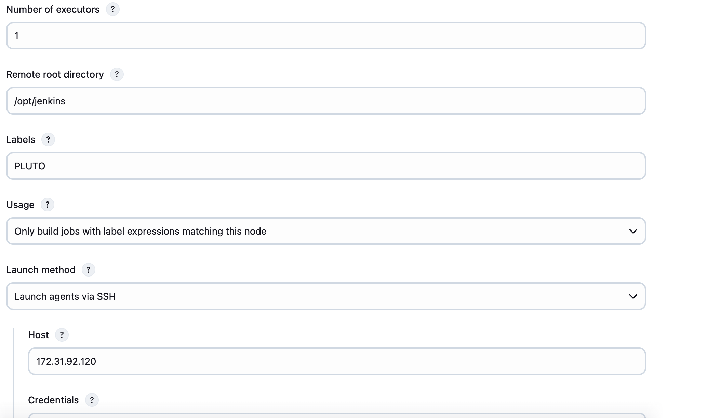
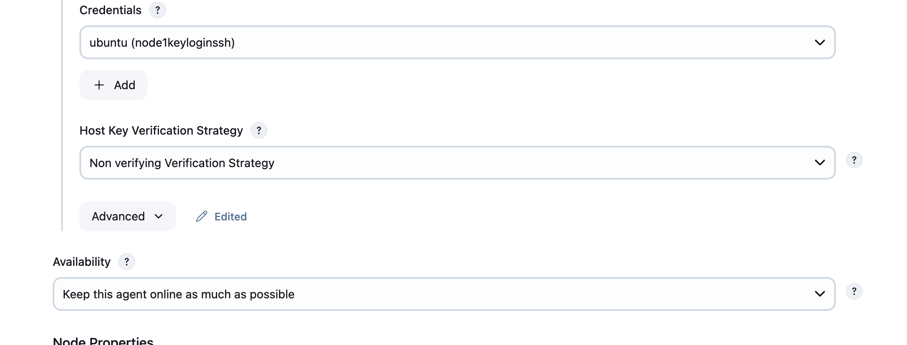

# Adding Node or agent to Jenkins
### Jenkins uses 2 type of login

Initial steps before adding the node

1. Create/get any Machine or create one in AWS EC2
2. Login to it using root user and make sure you download java of latest version
3. create user `adduser devops` 
4. create folder that need to have full access user **devops** and to group **ubuntu**.
    - `mkdir -p /opt/jenkins`
    - `chown devops:ubuntu /opt/jenkins/`
    - `chmod 770 /opt/jenkins/` full access to user devops and ubuntu group
5.  Then go to jenkins :
    - Manage jenkins -> nodes -> create node -> add all the details 
    - i have given name as pluto and select as permanent member and follow the below image. here we added the tag and selected **Only build jobs with label expressions matching this node** which means only execute on this node when it is explicitly mention. Another option is if that agent is free then the job will run on thet agent.
    
    - then for credentils we can use two types: 
    1. Password based login :
    - By default password login is disabled to enabled edit the file `vim /etc/ssh/sshd_config` (most of the linux machins) look for line 57 or search for PasswordAuthentication to yes and restart the ssh service using `systemctl restart ssh` for RPM based service will be **sshd**
    - For Ubuntu above 2022 need to edit `vim /etc/ssh/sshd_config.d/60-cloudimg-settings.conf` file with turn on to PasswordAuthentication to yes then restart the ssh service.
    - then you can login using cmd `ssh devops@IP_ADDRESS` then enter password
    - In jenkins create username and password creadentila and choose it
    2. Key based login: 
        - Create the ssh login credentials and paste the private key of the host there and create
        - choose it ans save and apply
6. choose below as follow
    
    - Non verifying Verification Strategy means don't ask any questions while connecting
7. you can see the log of agent it will show **Agent successfully connected and online**
8. To run on that agent create a new job, give name and select free style in configure there is option called **Restrict where this project can be run** so lect that and mention the label.
9. To execute in pipeline mention `agent { label 'label_name|tag_name' }` in pipeline scripe (Jenkinsfile) 
