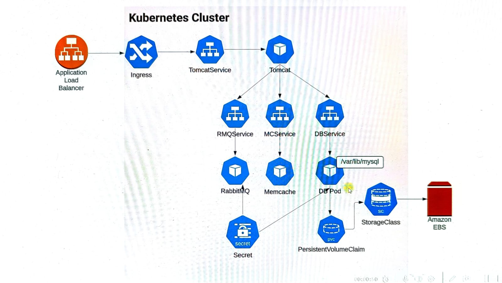

## Project

### Requirement
- High Availablity
- Fault Tolerance
- Easily Scalable
- Platform independent
- Portable and Flexible (Auto Healing)

#### Solution is to deploy the application on Container Orchestration

### Steps

- Need K8S cluster (I am using kOps)
- Containerised apps (vprofile)
- Create EBS volume for DB pod
- LABEL Node with zones names
- Writing k8s files for deployment , service, secret, volume

### Architecture

