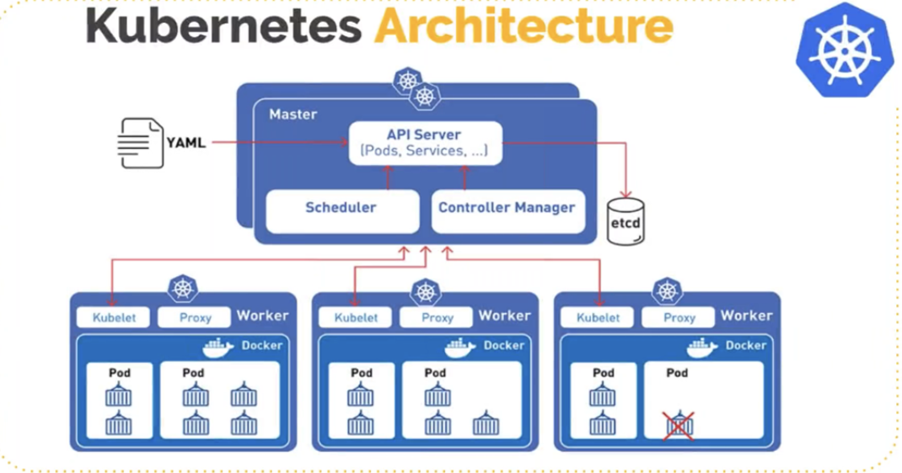
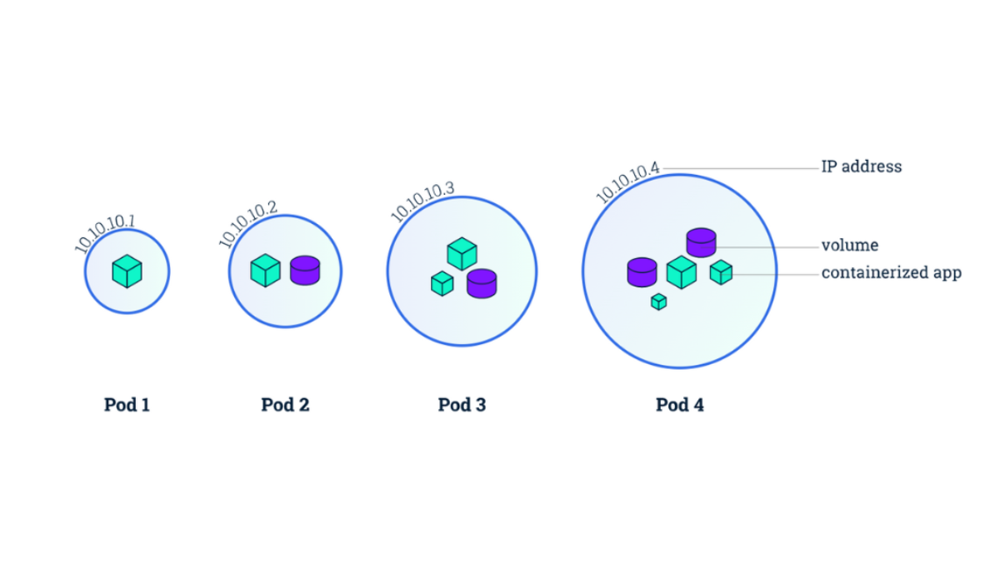
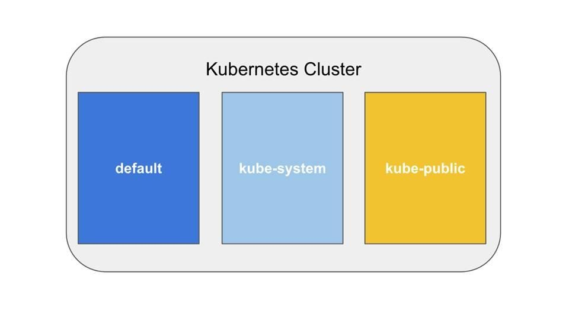
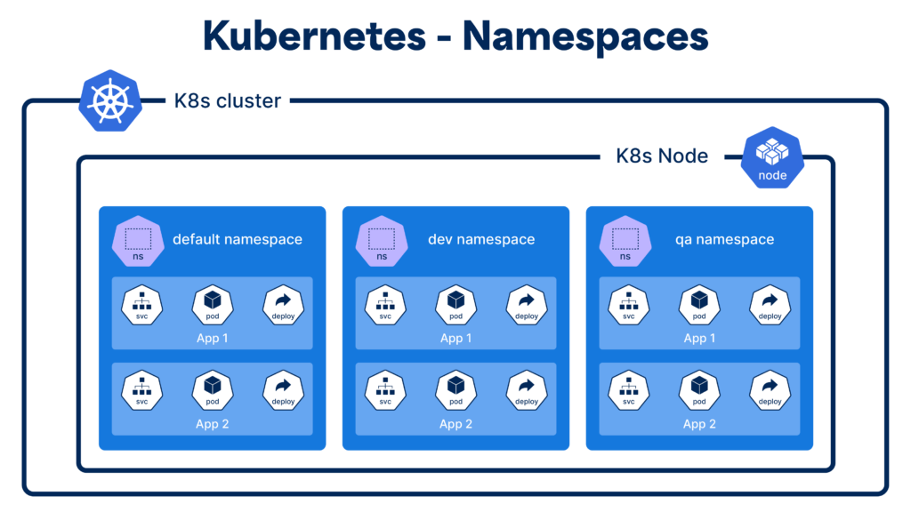
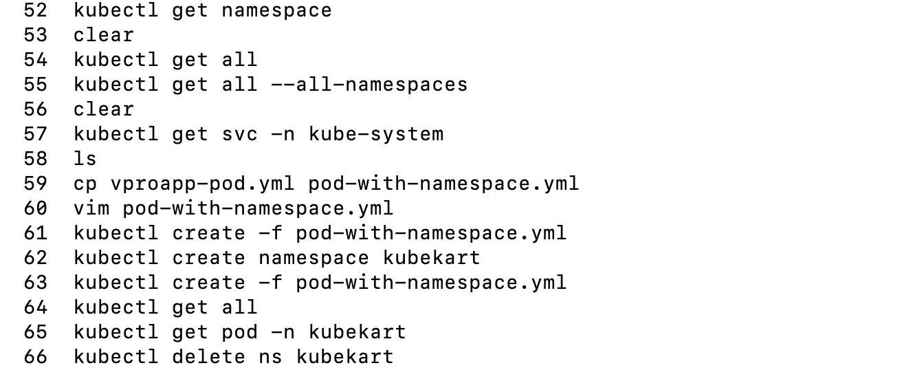
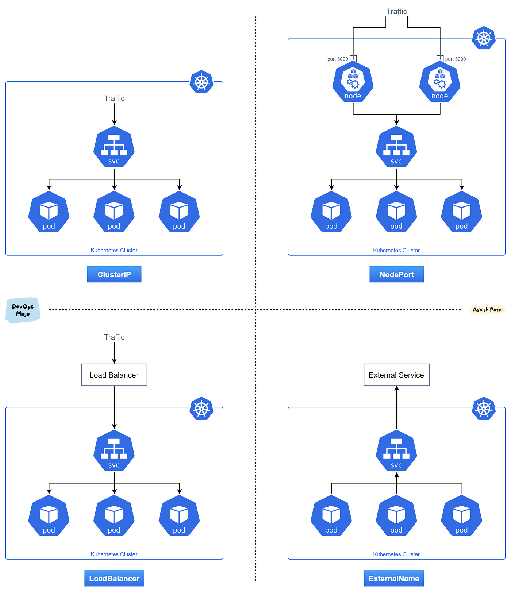
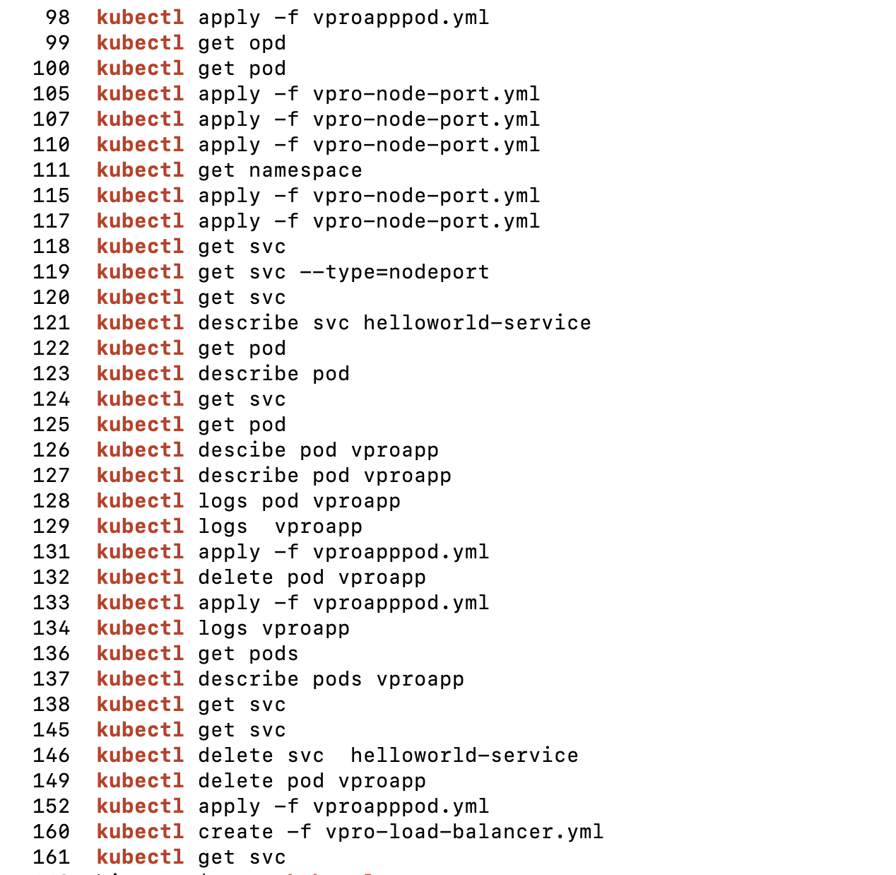
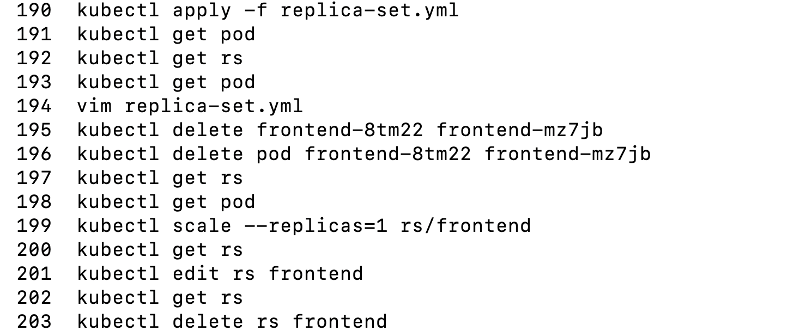
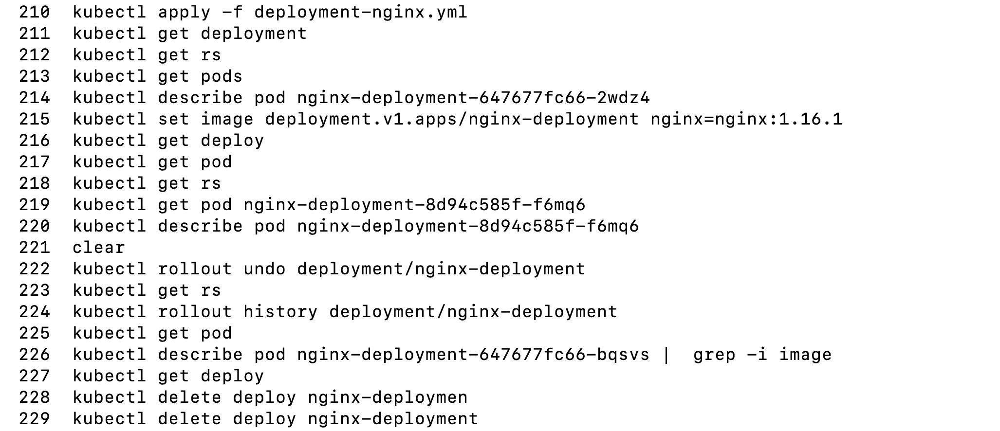

# Kubernetes

### Container Orchestration
- Clustering
    - Master node(Orchestrator) -> clusters ( worker nodes)

### Orchestration Tools
- Docker Swarm
- Kubernetes
- Mesosphere marathon
- AWS ECS & EKS 
- Azure Container Service
- Google Container Engine
- Core Fleet
- OpenShift

## Kubernetes Provides
- Service discovery and load balancing
- Storage orchestration
- Automated rollouts and rollbacks
- Automatic bin packing
- Self-Healing
- Secret and configuration mgmt

## Kubernetes Architecture

- Master node:
    1. API Server:
        - hanldles all the request and enables communication across stack services
        - Componet on the master that exops the K8s API
        - It is the from-end for k8s control plane (master node)
        - Admin connects to it using `Kubectl` cli
        - Web Dashboard and be integrated using API
    2. ETCD Server:
        - Stores all the information
        - Consistent and highly available key value store used as Kubernetes backing store for all cluster data
        - Kube API stores retrives info from it
        - Sholud be backed up regularly.
        - Stores current state of everything in cluter
    3. Kube Scheduler
        - Watchs newly created pods that have no nodes assigned, and select node for them to run on
        - Factors taken into account for scheduling decisions include
            - individule and collective resource requirement
            - hardware/software/policy constraints
            - affinity or anti affinity specifications
            - data locality
            - inter-workload interference and deadlines
    4. Controller Manager:
        - Each controller is seperate process
        - To reduce their complexity, they all complied to single binary and run in a single process
        - controllers include:
            - Node controller: resposible for responding when node go down
            - Replication controller (Auto-healing): Monitoring or maintining the correct num of pod for each rs
            - Endpoint controller: Populates the endpoint object (that is, joins Service & pods)
            - Service Account & Token Controllers: Create default accounts and API access tokens for namespace
    5. Cloud Controll Manager:
        - when impleted on any clous they have pre weitten code to generate IP of load balancer and etc
- Worker Node:
    1. Kubelet:
        - An agent that runs on each node in the cluster. it make sure that containers are running in pod
    2. Kupe Proxy
        - network proxy that runs on each node in your cluster
        - Network rule:
            - rules that allows or denays traffic
    3. Container runtime:
        - Kuberneties supports several runtime like
            - Docker
            - containerd
            - cri-o, rklet
            - Kubernetes CRI (Container runtime interface)

- Addons
    - DNS
    - Web UI
    - Container Resource Management
    - Cluster level logging

- Pods:
    - Pod will provide all the resource to the container
    - container will be running inside the pod
    - Container will be like process and pod will be like VM
    - K8S use pods for abstraction like it runs the containers like tomcat and pods provide the IP address
    - It may have one or many containers
    - It may also have volume
    - Idealy one container running in pod and other container in pods are helper containers
    - Pods will we distributed in multiple workers nodes

    

- Network overlay
- K8S setup tolls
    - Hard way: manul Step
    - Minikude:
        - one node K8S cluster on your computer
    - Kubeadm:
        - Multi node k8s cluster
        - Can be created on anyplatform vm's, ec2, physical machines etc
    - kops:
        - Multinode k8s cluster on AWS
        - now it suppts all GCE, Azure

### Setting Kops
- Install cops for operating system
- This requried a domain for creating a clustur
- generate a ssh key using `ssh-keygen`
- Then create a IAM user and configure the machine with credentials
- Make sure aws-cli is installed in system
- then create hosted zone in route 53 then add the naming server in domain registration
- create s3 bucket with unique
- Run the following cmd's to create cluster
    ```bash
        # create cluster
        kops create cluster --name=kubevpro.manojm.site --state=s3://kopsstatemanm --zones=us-east-1a,us-east-1b --node-count=2 --node-size=t3.small --control-plane-size=t3.medium --dns-zone=kubevpro.manojm.site --node-volume-size=12 --control-plane-volume-size=12 --ssh-public-key ~/.ssh/id_ed25519.pub

        #update cluster
        kops update cluster --name=kubevpro.manojm.site  --state=s3://kopsstatemanm --yes --admin

        #validate
        kops validate cluster --name=kubevpro.manojm.site  --state=s3://kopsstatemanm

        #delete 
        kops delete cluster --name=kubevpro.manojm.site  --state=s3://kopsstatemanm --yes
    ```
## K8s Objects
- pod : contains and maintains container
- service: load balancers etc.
- Replica set: contains pod
- Deployment: similar to RS , deploy new rs with img tags
- config map
- Secret
- Volumes

## Kubeconfig File:
- Helps to authenticate, get and have info's of clusters, users
- Present in `~/.kube/config`
- this can be used anywhere
    - used in jenkins
    - used in cloud and etc 
- Example info
    ```yml
        apiVersion: v1
        clusters:
        - cluster:
            certificate-authority-data: DATA+OMITTED
            server: https://api.kubevpro.manojm.site
            tls-server-name: api.internal.kubevpro.manojm.site
        name: kubevpro.manojm.site
        contexts:
        - context:
            cluster: kubevpro.manojm.site
            user: kubevpro.manojm.site
        name: kubevpro.manojm.site
        current-context: kubevpro.manojm.site
        kind: Config
        preferences: {}
        users:
        - name: kubevpro.manojm.site
        user:
            client-certificate-data: DATA+OMITTED
            client-key-data: DATA+OMITTED
    ```

## Pods

- Run your app isolated
- smallest and basic unit 
- Pods that run singe container
    - pods are wrapper around container
    - k8s manages pods rather then container directly
- Multi container pod
    - tightly coupled and nned to share resources
    - one main container others as a sidecar or init container
    - Each pod is meant to run a single instances of given application 
    - Should use multiple pods to scale horizontally
- cmds
    ```yml
        #create pod
        kubectl create -f pod-setup.yml

        #get pod
        kubectl get pod

        #get comprlete details of pod
        kubectl describe pod <pod-name>

        #get pod details in yml
        kubectl get pod <pod-name> -o yaml

        #get pod details and store it in yml
        kubectl get pod <pod-name> -o yaml > webpod-defination.yml

        #editing pod
        kubectl edit pod <pod-name>

        #login to pod
        kubectl exec --stdin --tty configmap-demo-pod -- /bin/bash
    ```

## Namespaces (grouping and isolating resources)
- Default namespaces, get created when cluster is created
    
- can create different namespaces for diff env (dev/qa/prod)
- or can create diff namespace for diff projects
    
- cmds
    
    - deleting ns is going to delete all the resources in ns

## Levels of logging
- You will get erros in events when you run describe pod

## Service
- similar to load balancers
- way to expose an application running on a pods as a network service
- pods are disposible , and mortal and IP are not static
- so service gives static IP similar to ELB in aws
- they connect accorurding to `Label Selector`
- if the pads have smae label then the service is auto matically to that pod (`Auto discovery`)
- Backend port and container posrt should be same
- 3 types:
    1. NodePort:
        - similar to port mapping in docker
        - this is for non prod purpose
        - only to expoe to outside network
    2. Cluster IP:
        - not for outsive only for internal
        - only for internal cummunication like mysql to tomcat
    3. Load Balancer:
        - this to to expose outside world and for production usecases


- Cmds



## Replica Set
- Maintains the replica of pod
- Wehn pod goes down no one can see access
- So , if the pod is running with rs then there are may pod in 1 rs so user con access another pod if one goes down


## Deployment
- Most ues object by Devops
- Upgrade, Rollback, changes Gracefully
- It Provides declarative updates for pods and replica sets
- Define desired state in a deployment, and the Deployment controller changes the actual state to the desired state at a controlled rate
- Deployment create a rs to manage number of pods
- First you deploy the app with v1 tag and then you upgrade with v2 tag if anythig goes wrong then it will easily rollback to v1 .



## Volumes
- Better storage solution is Persistent volume

## Config Maps
-   ```bash
        #imperatative way of creating config map
        kubectl create configmap config_name --from-literal=KEY1=VALUE1 --from-literal=KEY2=VALUE2

        #get config-maps
        kubectl get cm

        #display in yaml
        lubectl get cm db-config -o yaml
    ```
- 4 ways to get in pods:
    - as cmd and args
    - env var for container
    - add file in read-only volume, for the application to read
    - write code to run inside the pod that uses the kubernetes API to read a config map

## Secrets
- Share encoded/encrypted variable to POD
- similar to config map put values are encoded
```bash 
    #imperative way
    kubectl create secreate generic <secret_name> --from-literal=KEY1=VALUE1
```
- But in declarative way in yml we need to provided the already encoded value
- In linux you encode/decode value using
```bash
    #encode
    echo -n "somecomplexpassword" | base64

    #decode
    echo -n "encodedValue" | base64 --decode
```
## Jobs
- To run a container for defenite period of time
- Similar to CRON job in linux

## Deamon set
- actually used to get logs
- for monitoring nodes including master node
## Cheet sheet and other cmds
- Official cheatsheet: [cheatsheet](https://kubernetes.io/pt-br/docs/reference/kubectl/cheatsheet/)
```bash
    #cmd for dry run and get def file
    kubectl run pod_name --image=nginx --dry-run=client -o yaml > nginxPod.yml

    kubectl create deployment deploy_name --image=nginx --dry-run=client -o yaml > ngdeploy.yml
```